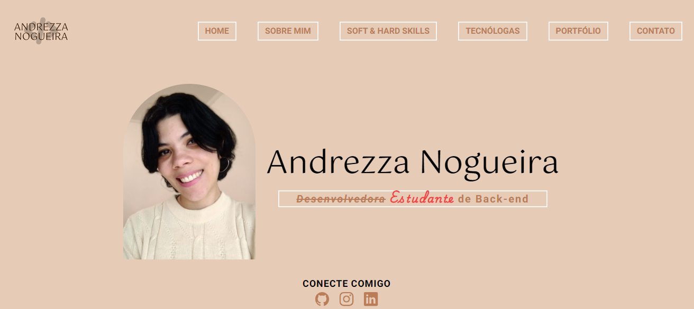

# Projeto portfolio pessoal

*_Preview do header e nav já feito_*

### Projeto sendo criado com as seguintes skills
 

  

### Para execução do projeto:

- inicie o npm do `package.json` no terminal:
`npm install`

- Execute o tailwindCSS:
`npx tailwindcss -i ./src/css/styles.css -o ./src/dist/output.css --watch`

 

_Em construção..._
